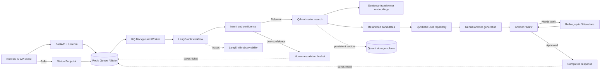

# Amazon Bot Assistant

Modular FastAPI backend for Amazon support queries. The LangGraph workflow:

```text
classify_query
  -> relevance/confidence route
  -> retrieve 20 Qdrant candidates
  -> rerank and keep 5 conversations
  -> load synthetic user context
  -> generate grounded answer
  -> review answer
  -> refine up to 3 iterations
  -> completed response or human escalation
```

The historical data is treated as complete conversations, not isolated tweets.
The supplied Qdrant collection and stored vectors are reused; indexing is not
performed by the API.

## System design

AmazonBot uses a retrieval-augmented, stateful support workflow powered by an asynchronous background task queue. Each request is enqueued to a background worker, classified before retrieval, grounded in the most relevant historical conversations and synthetic customer context, then reviewed before completion or escalation.



### Request lifecycle

1. The API validates the user and query, enqueues a job to RQ (Redis), and returns a `task_id` (`202 Accepted` style).
2. The frontend polls `/chat/status/{task_id}` for the response.
3. The background worker pulls the task and starts a `GraphState` run.
4. Classification routes irrelevant or low-confidence requests to escalation.
5. Relevant requests search Qdrant for 20 candidates and keep the best 5 after reranking.
6. The workflow loads synthetic orders, subscriptions, and profile context.
7. Gemini generates a grounded answer, and a review node approves or refines it.
8. The worker saves the answer with intent, confidence, selected evidence, review details, or escalation metadata to Redis.
9. The polling frontend retrieves the final state from Redis.

## Skills and technology

| Area | Skills and tools used |
| --- | --- |
| Backend engineering | Python, FastAPI, Uvicorn, REST API design |
| Asynchronous Tasks | Redis, RQ (Redis Queue), background workers, API polling |
| AI orchestration | LangGraph state machines, conditional routing, bounded refinement loops |
| LLM application development | Gemini, LangChain prompts, grounded generation, answer review |
| Retrieval and ranking | Sentence-transformer embeddings, Qdrant vector search, semantic reranking |
| Data engineering | JSON/CSV ingestion, conversation modeling, synthetic user repositories |
| Reliability | Confidence thresholds, human escalation, explicit configuration errors, mocked tests |
| Observability | LangSmith tracing for graph runs and node-level spans |
| Infrastructure | Docker Compose, Redis caching, persistent Qdrant volumes, environment-based configuration |
| Developer workflow | Pytest, modular Python packages, typed schemas, PowerShell runbooks |

## Configuration

Copy `.env.example` to `.env` and set:

```dotenv
GEMINI_API_KEY=your-key
GEMINI_MODEL=gemini-3.5-flash-lite
LANGCHAIN_TRACING_V2=true
LANGCHAIN_API_KEY=your-langsmith-key
LANGCHAIN_PROJECT=amazon-bot-assistant
QDRANT_URL=http://localhost:6333
QDRANT_COLLECTION_NAME=amazon_customer_queries
REDIS_URL=redis://localhost:6379/0
```

Never commit `.env` or an API key. The application raises an explicit error if `GEMINI_API_KEY` is missing.

## Run with Docker Compose

```powershell
docker compose up -d --build
```

This starts the FastAPI application at `http://localhost:8000`, the RQ background worker, Redis, and Qdrant at `http://localhost:6333`. Docker Desktop must be running.

Check all service health states:

```powershell
docker compose ps
Invoke-WebRequest http://localhost:8000/health
```

Inspect the existing Qdrant collection before sending chat requests:

```powershell
docker compose exec api python -c "from amazon_bot.retrieval import get_client; print(get_client().get_collections())"
```

If the collection has not yet been created, run the existing indexer:

```powershell
docker compose exec api python data\index_data\vector_index_data.py
```

The indexer requires the configured embedding model and source data. Set `GEMINI_API_KEY` in `.env` before using `/chat`; the health endpoint does not require it.

To stop the stack:

```powershell
docker compose down
```

## Run the API without Docker

To run only Qdrant and Redis in Docker and the API on the host, use:

```powershell
docker compose up -d qdrant redis
```

If Docker Desktop is not running, start it first.

### Start the API and Worker

```powershell
.\env\Scripts\python.exe -m pip install -r requirements.txt
```

You must start the API server and the background worker in separate terminal windows:

**Terminal 1 (API Server):**
```powershell
.\env\Scripts\python.exe -m uvicorn amazon_bot.api:app --host 0.0.0.0 --port 8000
```

**Terminal 2 (RQ Worker):**
```powershell
.\env\Scripts\python.exe -m amazon_bot.worker
```

Endpoints:

- `GET /` - browser test interface
- `GET /health`
- `POST /chat` - returns `{ "task_id": "...", "status": "pending" }`
- `GET /chat/status/{task_id}` - returns workflow state once complete

Example:

```powershell
curl.exe -X POST http://localhost:8000/chat `
  -H "Content-Type: application/json" `
  -d '{"user_id":"demo_user_001","query":"My package is six days late"}'
```

The response contains a `task_id`. You then poll:

```powershell
curl.exe -X GET http://localhost:8000/chat/status/<TASK_ID>
```

Open `http://localhost:8000/` in a browser to use the simple test interface, which automatically handles the asynchronous polling logic.

## Synthetic user repository

`amazon_bot/synthetic_users.py` exposes `UserRepository` and a `SyntheticUserRepository`. Its orders, subscription, and profile values are explicitly hypothetical. Replace that implementation with a real repository adapter later without changing graph nodes.

## Data Engineering & Analysis

The raw data processed by the bot's data engineering pipeline (found in `data_engineering.py`) undergoes significant cleaning and topic modeling. 

**Dataset Statistics:**
- **Initial raw dataset**: 2,811,774 customer support tweets.
- **Filtered Customer queries**: 99,789 (English, non-null, targeting @AmazonHelp).
- **Filtered Amazon Support responses**: 132,061.

The pipeline uses `BERTopic` and `sentence-transformers` (all-MiniLM-L6-v2) to extract underlying customer intents, identifying key clusters such as:
- **Delivery/Shipping** (Package tracking, delays)
- **Account Issues** (Password resets, locked accounts)
- **Refunds/Returns** (Order cancellation, money refunds)
- **Digital Services** (Prime Video, Kindle, Amazon Pay cashback)

## LangSmith

Set `LANGCHAIN_TRACING_V2=true`, `LANGCHAIN_API_KEY`, and `LANGCHAIN_PROJECT` in `.env`. LangChain/LangGraph automatically reports the graph run and node spans to the configured LangSmith project.

## Tests

The project employs multiple layers of testing to ensure reliability, found within the `tests/` directory:

1. **Unit Tests (`test_reranking.py`, `test_workflow.py`)**
   - Tests individual components like the semantic reranker and the LangGraph state machine.
   - Verifies conditional routing, answer review loops, and state transitions without requiring external services.
2. **API Integration Tests (`test_api.py`)**
   - Tests the FastAPI endpoints (`/chat`, `/chat/status`, `/human-bucket`, `/health`).
   - Mocks the LLM, Redis, and retrieval layer to verify asynchronous task creation, polling logic, Redis-backed session history, and human-bucket ticket lifecycle.
3. **End-to-End Browser Tests (`test_selenium.py`)**
   - A browser smoke test suite using Selenium and headless Chrome.
   - Automatically interacts with the `index.html` frontend UI to test real user flows (sending queries, polling for async responses, UI error rendering).

To run the full suite:

```powershell
.\env\Scripts\python.exe -m pytest -q
```

To run only the API tests:

```powershell
.\env\Scripts\python.exe -m pytest tests\test_api.py -q
```

To run the Selenium UI tests (requires Chrome installed):

```powershell
.\env\Scripts\python.exe -m pytest tests\test_selenium.py -q
```
