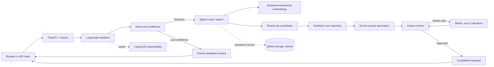

# Amazon Bot Assistant

Modular FastAPI backend for Amazon support queries. The LangGraph workflow:

```text
classify_query
  -> relevance/confidence route
  -> retrieve 20 Qdrant candidates
  -> rerank and keep 5 conversations
  -> load synthetic user context
  -> generate grounded answer
  -> review answer
  -> refine up to 3 iterations
  -> completed response or human escalation
```

The historical data is treated as complete conversations, not isolated tweets.
The supplied Qdrant collection and stored vectors are reused; indexing is not
performed by the API.

## System design

AmazonBot uses a retrieval-augmented, stateful support workflow. Each request
is classified before retrieval, grounded in the most relevant historical
conversations and synthetic customer context, then reviewed before completion
or escalation.



### Request lifecycle

1. The API validates the user and query, then starts a `GraphState` run.
2. Classification routes irrelevant or low-confidence requests to escalation.
3. Relevant requests search Qdrant for 20 candidates and keep the best 5 after reranking.
4. The workflow loads synthetic orders, subscriptions, and profile context.
5. Gemini generates a grounded answer, and a review node approves or refines it.
6. The API returns the answer with intent, confidence, selected evidence, review details, or escalation metadata.

## Skills and technology

| Area | Skills and tools used |
| --- | --- |
| Backend engineering | Python, FastAPI, Uvicorn, Pydantic, REST API design |
| AI orchestration | LangGraph state machines, conditional routing, bounded refinement loops |
| LLM application development | Gemini, LangChain prompts, grounded generation, answer review |
| Retrieval and ranking | Sentence-transformer embeddings, Qdrant vector search, semantic reranking |
| Data engineering | JSON/CSV ingestion, conversation modeling, synthetic user repositories |
| Reliability | Confidence thresholds, human escalation, explicit configuration errors, mocked tests |
| Observability | LangSmith tracing for graph runs and node-level spans |
| Infrastructure | Docker Compose, persistent Qdrant volumes, environment-based configuration |
| Developer workflow | Pytest, modular Python packages, typed schemas, PowerShell runbooks |

## Configuration

Copy `.env.example` to `.env` and set:

```dotenv
GEMINI_API_KEY=your-key
GEMINI_MODEL=gemini-3.5-flash-lite
LANGCHAIN_TRACING_V2=true
LANGCHAIN_API_KEY=your-langsmith-key
LANGCHAIN_PROJECT=amazon-bot-assistant
QDRANT_URL=http://localhost:6333
QDRANT_COLLECTION_NAME=amazon_customer_queries
```

Never commit `.env` or an API key. The application raises an explicit error if
`GEMINI_API_KEY` is missing.

## Run Qdrant

```powershell
docker compose up -d qdrant
```

If Docker Desktop is not running, start it first. Inspect the existing
collection before serving traffic:

```powershell
.\env\Scripts\python.exe -c "from amazon_bot.retrieval import get_client; print(get_client().get_collections())"
```

If the collection has not yet been created, run the existing indexer:

```powershell
.\env\Scripts\python.exe data\index_data\vector_index_data.py
```

## Start the API

```powershell
.\env\Scripts\python.exe -m pip install -r requirements.txt
.\env\Scripts\python.exe -m uvicorn amazon_bot.api:app --host 0.0.0.0 --port 8000
```

Endpoints:

- `GET /` - browser test interface
- `GET /health`
- `POST /chat`

Example:

```powershell
curl.exe -X POST http://localhost:8000/chat `
  -H "Content-Type: application/json" `
  -d '{"user_id":"demo_user_001","query":"My package is six days late"}'
```

The response contains the selected conversations, intent, confidence, answer,
review result, or a human-bucket payload containing the escalation reason.

Open `http://localhost:8000/` in a browser to use the simple test interface.

## Synthetic user repository

`amazon_bot/synthetic_users.py` exposes `UserRepository` and a
`SyntheticUserRepository`. Its orders, subscription, and profile values are
explicitly hypothetical. Replace that implementation with a real repository
adapter later without changing graph nodes.

## LangSmith

Set `LANGCHAIN_TRACING_V2=true`, `LANGCHAIN_API_KEY`, and
`LANGCHAIN_PROJECT` in `.env`. LangChain/LangGraph automatically reports the
graph run and node spans to the configured LangSmith project. Open
https://smith.langchain.com, select the project, and inspect runs for
classification, retrieval, reranking, answer generation, review, refinement,
and final escalation/completion.

## Tests

The tests mock the LLM and retrieval layer:

```powershell
.\env\Scripts\python.exe -m pytest -q
```
